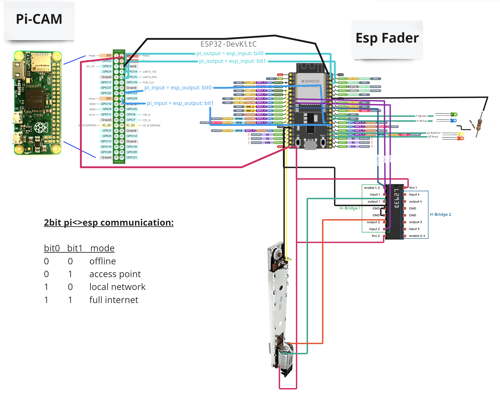

Smart IoT Security & Privacy - Configurable Connection Modes (Hardware Part)

Raspberry Pi Camera with configurable connection modes:
🔴Offline/None -> 🟡AccessPoint -> 🔵LocalNetwork -> 🟢FullInternet

The modes are received by the Raspberry Pi from an interface and sent
to the Esp32 to set the fader.
The modes can be also physically changed on the fader and are then
sent to the Pi and back to the interfaces' backend.

